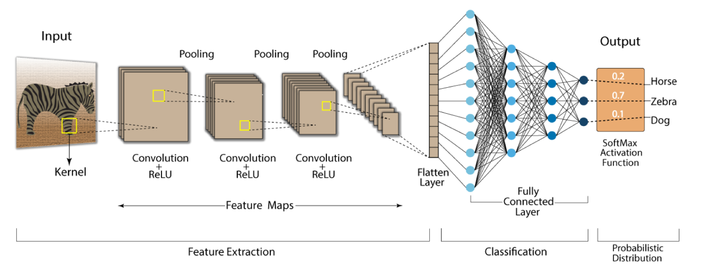

# Images Classification 🖼📸

Image classification using a costumize Convolutional Neural Network (CNN).




## Overview

This project was carried out at *Johannes Kepler University Linz* during my Erasmus program. It was developed as part of a course challenge and involved implementing a customized Convolutional Neural Network (CNN) using **PyTorch** to classify images into 20 distinct classes.

The project includes:
- Classification of images into 20 classes using a dataset of *12,484 images* collected by course participants.
- Implementation of a custom CNN model (`MyCNN`) for training and evaluation.
- Final testing on a hidden dataset (challenge server) using a provided evaluation function.

All images are resized to **100 pixels** (width or height) with labels provided in a `labels.csv` file.

### **Dataset Classes**
| Class ID | Class Name     | Image Count |
|----------|----------------|-------------|
| 0        | book           | 739         |
| 1        | bottle         | 717         |
| 2        | car            | 500         |
| 3        | cat            | 569         |
| 4        | chair          | 508         |
| 5        | computermouse  | 534         |
| 6        | cup            | 774         |
| 7        | dog            | 464         |
| 8        | flower         | 880         |
| 9        | tree           | 594         |
| 10       | fork           | 605         |
| 11       | glass          | 578         |
| 12       | glasses        | 436         |
| 13       | headphones     | 459         |
| 14       | knife          | 790         |
| 15       | laptop         | 446         |
| 16       | pen            | 954         |
| 17       | plate          | 433         |
| 18       | shoes          | 899         |
| 19       | spoon          | 625         |

---

The dataset used was created specifically for the challenge and due to privacy concerns, it is private and cannot be shared. 


## Example Usage
1. **Set the working directory**: Ensure all required files (as described in the "Structure" section) are present in the directory.

2. **Prepare the dataset**:

   - Place images in `.jpg` format in the dataset folder.
   - Provide a `.csv` file containing labels for the dataset.

3. **Configure settings**: Optionally, edit the `working_config.json` file to adjust hyperparameters and other settings. Default settings match those used on the challenge server.

4. **Run the training script**:

   ```bash
   python main.py
   ```

   The script will prompt you to provide the dataset path. Once provided, it will proceed with:

   - **Data Splitting**: Splitting the dataset into training, validation, and test sets.
   - **Data Augmentation**: Augmentation techniques are applied to the training set to improve generalization.
   - **Model Training**: The MyCNN model is trained using the training set.
   - **Evaluation**: The model's performance is evaluated on the validation set.
   - **Early Stopping**: Training halts if no improvement in validation loss is observed for a specified number of epochs.
   - **Model Saving**: The best model (based on validation loss) is saved automatically.. 

To evaluate the model on the test set, the `evaluate_model` function in `main.py` replicates the evaluation routine used on the challenge server, ensuring consistency in performance metrics.


## Structure

The project structure is as follows:

```
|- main.py
|       Main file. Includes training and evaluation routines.
|- dataset.py
|       Defines the ImagesDataset class and auxiliary functions for loading and preprocessing images.
|- utils.py
|       Contains utility functions for data augmentation and computing accuracy in the training loop.
|- architecture.py
|       Defines the MyCNN class implementing the custom CNN architecture.
|- working_config.json
|       Configuration file for hyperparameters and other settings. Defaults match the challenge server.
```

## Dependencies

Ensure the following dependencies are installed before running the project:

- `Python >= 3.8`
- `torch==2.2.2`
- `torchvision==0.17.2`
- `numpy==1.26.4`
- `Pillow==10.3.0`
- `tqdm==4.64.1`

To install all dependencies at once, run:

```bash
pip install -r requirements.txt
```

---


